# Nimbulux ✨

> [!NOTE]
> 一个正在建一切的家伙  
> 对可爱的东西毫无抵抗力...

> [!IMPORTANT]
> ⚠️ 拿代码去用之前，记得看一眼 **许可证**！  
> AGPLv3 死忠，小心被传染

## 关于我

- 正在用热爱建造各种奇怪又可爱的东西
- 主力语言 **Python**，**C** 语言努力中（这个“存疑”是不是很诚实）
- 日常：**I use Arch Linux, btw.** （你懂的）

## 技术栈 & 许可证

> 传教现场：AGPLv3 真的很好用，你要不要也试试？

## 统计卡片

## 联系我

- 博客：[nimbulux.github.io](https://nimbulux.github.io)
- 邮箱：[2121402422@qq.com](mailto:2121402422@qq.com)
- Bilibili：[这里](https://space.bilibili.com/1959403327) ~~不要看我的视频！有点羞耻~~
- 或者直接在我仓库里开个 Issue 聊天~

---

*这个主页和我一样，还在不断生长。很高兴你路过~*
